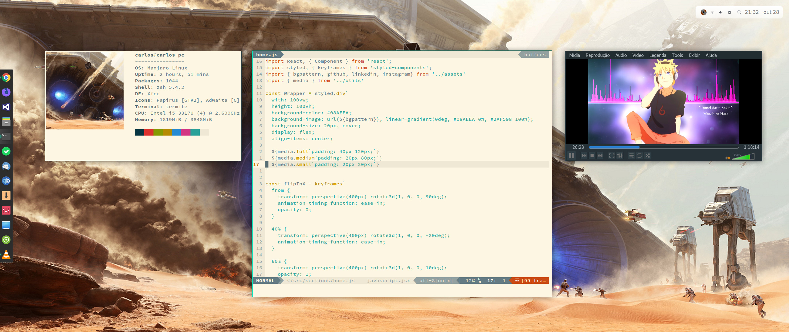

# My .dotfiles

</img>

## Features
- Git aliases
- Nice Powerlevel9k theme configuration
- Great Solarized color scheme for Termite and neovim
- Some Plank themes

## Installation
```sh
$ git clone https://github.com/carlosqsilva/dotfiles.git
$ cd ~/dotfiles
$ chmod +x install.sh
$ ./install.sh
```
