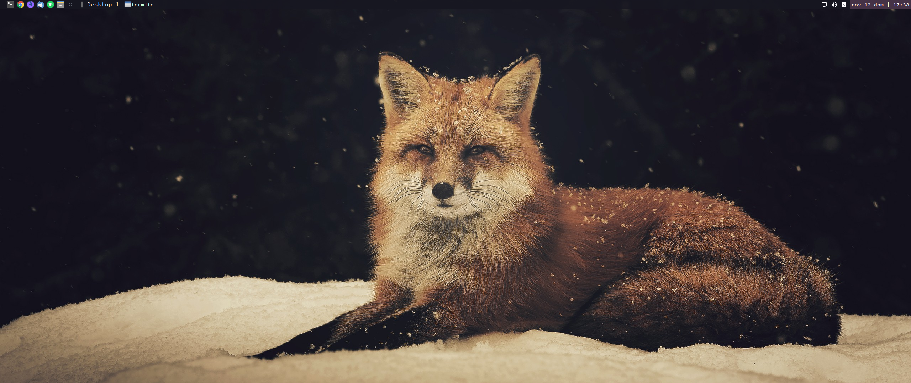
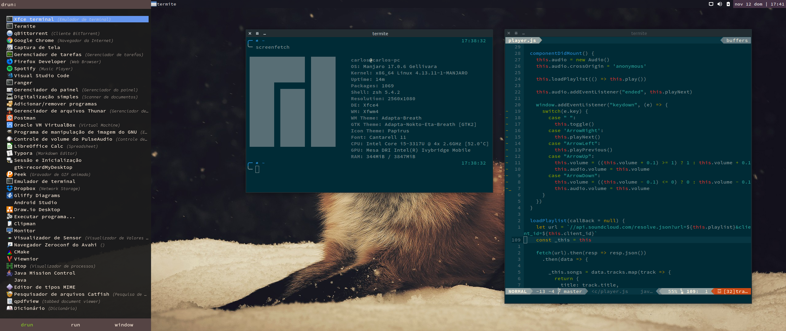

# My .dotfiles

</img>

</img>
[Download Wallpaper](https://alpha.wallhaven.cc/wallpaper/299064)

## Features
- Powerlevel9k theme configuration
- Solarized color scheme for Termite and neovim
- Plank themes
- Tint2 theme

## Installation

1. Install **GNU stow**.
2. Clone this repo in your **HOME** folder.

```sh
$ git clone https://github.com/carlosqsilva/dotfiles.git
$ cd ~/dotfiles
```

3. For each folder run `stow [FOLDER_NAME]`.
4. That's it. :sunglasses: